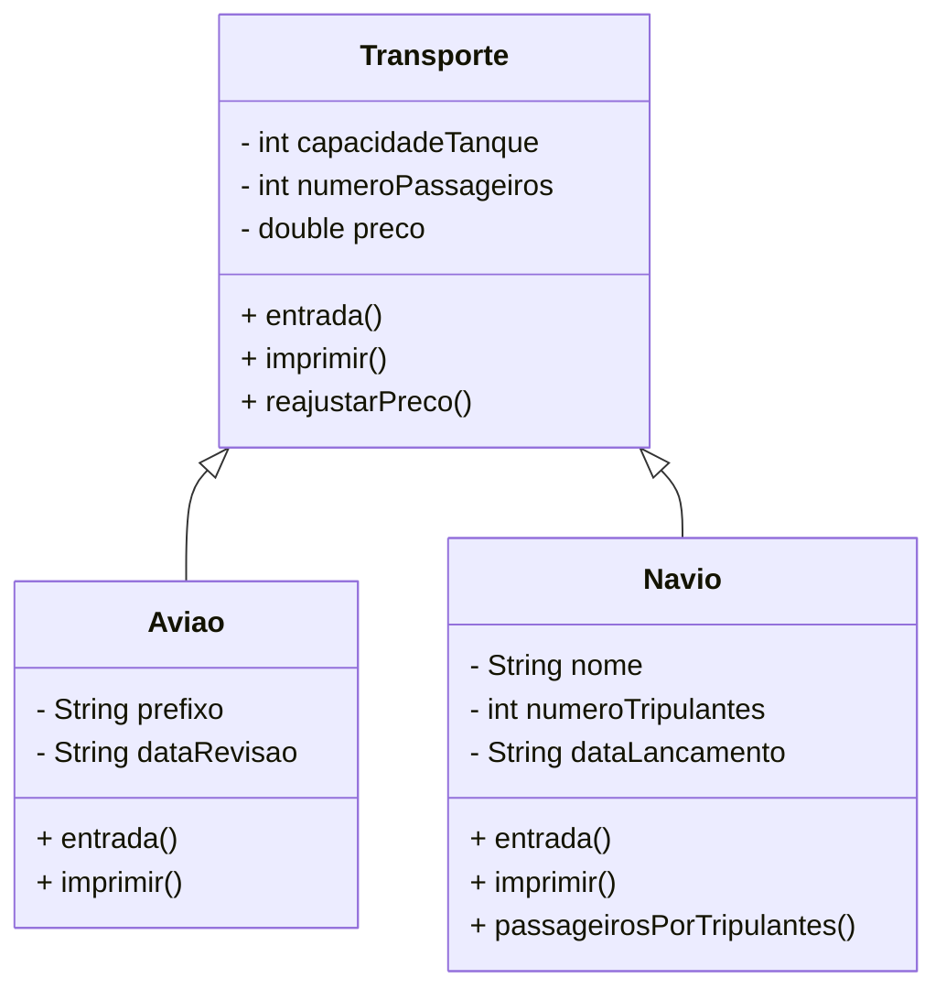

# Projeto: Sistema de Gerenciamento de Frota (Aviões e Navios) [](https://doi.org/10.5281/zenodo.17090003)

## 📌 Descrição
Este projeto consiste em uma aplicação Java orientada a objetos que implementa **herança, polimorfismo, tratamento de exceções e uso de vetores de objetos**.  
O objetivo é simular uma frota composta por **aviões e navios**, armazenados em um vetor polimórfico, garantindo robustez por meio de validações de entrada e testes unitários.

O trabalho segue o seguinte enunciado:
> "Desenvolvimento de projeto de aplicação com uso de vetores de objetos com tratamento de exceções. (...) A aplicação deve conter uma superclasse com atributos comuns, subclasses específicas (Aviao e Navio), e gerar um vetor único com dez objetos de cada tipo, protegendo a entrada de dados inválidos."

---

## 🏗 Estrutura do Projeto

- **Transporte.java**  
  Superclasse que representa qualquer meio de transporte, contendo:
  - Atributos comuns: `capacidadeTanque`, `numeroPassageiros`, `preco`
  - Construtores
  - Getters e Setters com validação
  - Métodos de entrada de dados com tratamento de exceções
  - Método `reajustarPreco(percentual)`  
  - Método `imprimir()`

- **Aviao.java**  
  Subclasse de `Transporte`, adiciona:
  - Atributos: `prefixo`, `dataRevisao`
  - Construtores
  - Métodos `entrada()` e `imprimir()`

- **Navio.java**  
  Subclasse de `Transporte`, adiciona:
  - Atributos: `nome`, `numeroTripulantes`, `dataLancamento`
  - Construtores (5 sobrecargas)
  - Método `passageirosPorTripulantes()`
  - Métodos `entrada()` e `imprimir()`

- **Main.java**  
  Classe de aplicação que:
  - Cria um vetor único `Transporte[] frota` de 20 posições
  - Preenche os 10 primeiros com `Aviao` e os 10 últimos com `Navio`
  - Solicita entrada de dados do usuário
  - Exibe todos os objetos da frota
  - Demonstra o uso do método `reajustarPreco`

- **FrotaTest.java**  
  Classe de teste JUnit que:
  - Cria 10 aviões e 10 navios com dados fixos
  - Valida os getters e métodos principais (`reajustarPreco`, `passageirosPorTripulantes`, `imprimir`)
  - Exibe logs no console para acompanhamento dos testes

---

## 📊 Diagrama de Hierarquia



## Como Rodar

Certifique-se de ter **Java JDK 11+** e **Maven** instalados.  
No terminal, execute:

```bash
mvn clean test
